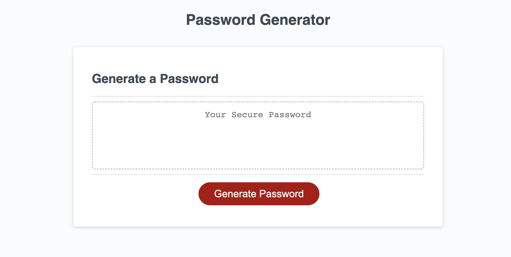

# RandomPasswordGeneratorTool

# Purpose

 Allows users to generate a random password while giving the user an option to select if they would like to include special characters, uppercase & lowercase letters or/and numeric characters.

# Built With

 HTML
 CSS
 JavaScript

# Website

# Screenshots of Website

;